# 目录

## 生成部分

1. 生成模型分类
2. VAE变分自编码器
3. GAN生成对抗网络
4. Diffusion扩散模型

## 理解部分

1. ViT

2. Clip

3. Blip

   .......

## 统一模型

1.  Begal
2.  Janus-pro
3.  MetaQueries
4.  UniWorld-v1
5.  WISE：基于世界知识的统一模型 BenchMark

# 参考资料

[【生成模型VAE】十分钟带你了解变分自编码器及搭建VQ-VAE模型（Pytorch代码）！简单易懂！—GAN/机器学习/监督学习](https://www.bilibili.com/video/BV1Uj411Y7Zq?vd_source=09ee16dc45777c7fbcbb424e736d6598)

[【李宏毅】2025最新的Diffusion Model教程！1小时清楚扩散模型原理，简直不要太爽！人工智能|机器学习|OpenAI](https://www.bilibili.com/video/BV19EVUzrEF4?vd_source=09ee16dc45777c7fbcbb424e736d6598)

[吹爆！VIT/BLIP/CLIP/Lora/LLaVA/LLama大模型六大基础模型详解！大模型入门必学！](https://www.bilibili.com/video/BV1g47nzTEAY?p=4&vd_source=09ee16dc45777c7fbcbb424e736d6598)

[UniWorld-V1: High-Resolution Semantic Encoders for Unified Visual Understanding and Generation](https://arxiv.org/abs/2506.03147)

[WISE: A World Knowledge-Informed Semantic Evaluation for Text-to-Image Generation](https://arxiv.org/abs/2503.07265)

[Janus-Pro: Unified Multimodal Understanding and Generation with Data and Model Scaling](https://arxiv.org/abs/2501.17811)

[BAGEL: Bootstrapping Agents by Guiding Exploration with Language](https://arxiv.org/abs/2403.08140)

[Transfer between Modalities with MetaQueries](https://arxiv.org/abs/2504.06256)

[Auto-Encoding Variational Bayes](https://arxiv.org/abs/1312.6114)

[Denoising Diffusion Probabilistic Models](https://arxiv.org/abs/2006.11239)

[High-Resolution Image Synthesis with Latent Diffusion Models](https://arxiv.org/abs/2112.10752)

[Generative Adversarial Networks](https://arxiv.org/abs/1406.2661)

# 生成模型分类

生成模型是当前深度学习研究的重要方向之一，其目标是学习训练数据的潜在分布，并据此生成与原始数据相似的样本。大多数生成模型采用无监督学习的方式，通过大量未标注的数据来建模其内在结构和生成规律。根据建模方式的不同，生成模型可以大致分为两类：**显式生成模型（Explicit Generative Models）**与**隐式生成模型（Implicit Generative Models）**。

显式生成模型直接对数据的概率分布进行建模，即构造并显式定义一个可计算的概率密度函数。这一类方法又可以根据分布的可解性进一步细分：一类是分布**可精确求解**的模型，例如 PixelRNN 和 PixelCNN，它们通过自回归机制建模图像中每个像素点的条件分布，优点是生成过程具有强表达能力且分布形式清晰，但缺点是生成速度较慢且序列建模开销较大；另一类是分布**不可精确求解**但可通过变分推断近似的模型，如变分自编码器（VAE），该方法在可解释性和训练稳定性方面表现良好，但生成样本往往缺乏清晰度和多样性。

相比之下，隐式生成模型不直接建模数据的概率分布，而是通过某种方式**学习一个能够采样的过程**，使得生成的样本服从某种未知但近似于真实数据分布的分布。生成对抗网络（GAN）是其中的典型代表，它通过引入判别器与生成器之间的博弈机制，引导生成器逐步提高样本的逼真程度，具有生成质量高、细节丰富等优势，但训练过程不稳定、易出现模式崩溃（mode collapse）等问题。扩散模型（Diffusion Model）是近年来崛起的另一类隐式模型，通过模拟图像的逐步噪声添加与去噪过程来生成数据，虽然训练和采样成本较高，但在生成图像的质量、多样性和稳定性方面表现出色，逐渐成为最前沿的研究热点之一。

总体而言，显式模型在建模理论和可解释性上具有一定优势，但生成质量和效率方面存在瓶颈；隐式模型则更加灵活和高效，尤其在图像、语音等高维数据生成任务中展现出强大能力。实际应用中，往往需要在表达能力、训练难度与生成效率之间做出权衡。·····-

## VAE变分自编码器

### 为什么使用后验而不是先验？

在生成模型中，我们希望通过边缘似然

p(x) = ∫ p(x | z) * p(z) dz

来刻画复杂的数据分布 `p(x)`，其中先验 `p(z)` 设为各维独立同分布的标准正态 `𝒩(0, I)`。

然而，直接从该先验随机采样 `z` 并要求解码器生成图像 `x` 面临两大难题：

1. 一方面，绝大多数 `z` 并不对应任何真实样本，因而无法计算重构误差；
2. 另一方面，无法解析地求出上述积分，导致对 `p(x | z)` 的极大似然训练不可行。

为此，我们转而对 **后验** `p(z | x)` 做近似，利用可学习的对角高斯分布：

q_φ(z | x) = 𝒩(μ_φ(x), diag(σ²_φ(x)))

作为变分分布：编码器为每个输入 `x` 输出 `μ` 与 `σ`，保证采样得到的每个 `z` 都有对应的监督样本，从而避免“无效训练”。

结合重参数化技巧：

z = μ + σ ⊙ ε, 其中 ε ~ 𝒩(0, I)

和 ELBO 损失函数：

L = E_{q_φ(z | x)} [log p_θ(x | z)] - KL(q_φ(z | x) || p(z))

我们即可同时学习解码器 `p_θ(x | z)`（近似原本难以直接优化的 `p(x | z)`）和编码器 `q_φ(z | x)`，在最大化下界的过程中既逼近真实后验又确保生成样本覆盖数据分布，实现对高斯混合式 `p(x)` 的有效建模。

如果我们仅仅使用原始图像和生成图像的 L2 损失作为梯度，那么网络生成的图像将失去多样性，`q_φ(z | x)` 和 `p(z)` 将趋于同分布。


### 为什么 latent 空间要用标准正态分布而不用均匀分布？

1. 标准正态分布具有良好的数学性质，具有良好的可导性、对称性、可分解性，这对于梯度优化、KL 散度计算等非常友好：

    - 标准正态分布易于使用重参数化技巧，使得梯度可回传：

    ```
    z = μ + σ * ε,    其中 ε ~ 𝒩(0, I)
    ```

    - 均匀分布没有简单可导的采样公式，导致梯度传播难以实现或不稳定（尤其是在边界）。

2. 均匀分布在高维空间中分布在一个高维超立方体的边界上，采样值更可能集中在边界，而不是中心，导致解码器训练不稳定。
# GAN生成对抗网络

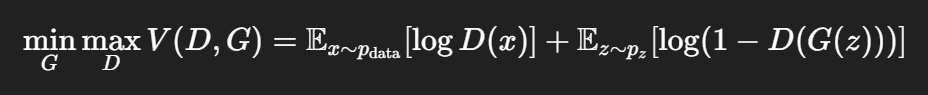

生成对抗网络是一种由生成器（Generator, G）和判别器（Discriminator, D）组成的对抗结构。其中，判别器的目标是最大化其对真实样本判别为真的概率，同时最小化对由生成器生成的伪样本判别为真的概率；换句话说，D 的目标是尽可能区分真实图像和伪造图像。而生成器的目标则是最小化判别器对其生成图像的判断误差，即尽可能“欺骗”判别器，使其认为生成图像来自真实分布。

在训练过程中，GAN 的优化可以分为两个交替阶段：

1. **训练判别器 D**：在该阶段，固定生成器 G，利用真实图像和生成图像更新判别器参数，使其具备更强的判别能力，即提升其对真假图像的分类精度。
2. **训练生成器 G**：固定判别器 D，利用判别器的判别结果反向传播梯度，更新生成器参数，使其生成的图像越来越接近真实图像，从而提升“以假乱真”的能力。

整个过程可以类比为一个“造假者”与“验钞机”之间的博弈：造假者不断改进制假技术，使假钞更难被识破；而验钞机（判别器）则持续升级算法，以识别越来越高仿的假钞。最终，双方在博弈中达到一个动态平衡点，使生成器能够生成非常逼真的图像。

与目前主流的图像生成方法相比，GAN 采用的是**博弈驱动的隐式生成策略**，并不显式建模数据的概率分布。这一点与变分自编码器和扩散模型显著不同：后两者通常基于明确的概率模型进行优化，目标是最大化数据的对数似然或其变分下界。

正因如此，近年来也有许多研究尝试融合 GAN 与其他概率生成模型的优势，例如 **VAE-GAN**，通过在 VAE 的解码器输出后引入一个判别器，使得重建图像在保持重构精度的同时也具备更高的视觉真实性，从而弥补了传统 VAE 图像模糊的问题。此外，也有 Diffusion-GAN、EBGAN 等多种架构创新，旨在结合不同生成范式的优势，推动图像生成模型向更高质量、更稳定的方向发展。

# Diffusion扩散模型

## Diffusion Model的两个关键公式

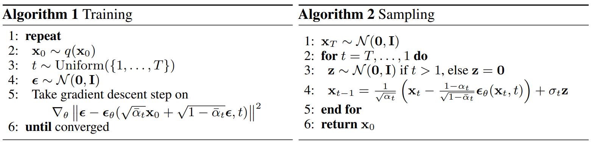

在扩散模型的训练阶段，首先从真实数据分布中采样一个样本 x_0，然后定义一个前向加噪过程，该过程模拟将图像逐步扰动为纯高斯噪声。然而，为了提高训练效率，模型并不逐步地执行加噪操作，而是通过一个**封闭形式的公式**，将噪声一步“加到位”，直接得到任意时间步 t 的带噪样本 x_t，这种处理方式利用了高斯噪声在马尔可夫链中的累积性，从而减小了逐步模拟过程带来的计算开销。

在反向生成阶段，模型并非直接预测最终图像，而是训练一个神经网络去**预测加噪过程中的噪声成分**。一旦前向加噪过程中的噪声调度表被预先设定，其它所有项都是已知的，因此模型的核心任务仅是学习如何从 x_t 中恢复出所添加的噪声。该预测再通过反向推导公式逐步去除噪声，最终还原出高质量的样本。

扩散模型的核心设计理念可以被视为一种**非自回归式的逐步生成机制**，其本质上借鉴了自回归模型中“逐步建模条件分布”的优势。自回归模型通过将数据的联合分布分解为一系列有序的条件分布，实现对数据分布的逐步学习与采样。然而，这种方式在图像等高维场景中存在一定的**采样效率低、并行性差**的问题。

扩散模型引入一个**马尔可夫链上的逐步反向生成过程**，在噪声空间向数据空间逐步还原，从而在不依赖传统自回归结构的前提下，保留了“逐步建模”的建模优势。每一步的生成过程依赖于上一步的输出，从而间接建立了**条件依赖链条**，实现了对复杂分布的有效逼近。可以认为扩散模型是一种**非自回归但结构上具备自回归建模特性的生成范式**。它结合了自回归模型中逐步建模带来的灵活性与高质量，同时通过高斯噪声建模和训练过程中的多步优化，增强了训练稳定性与样本多样性。

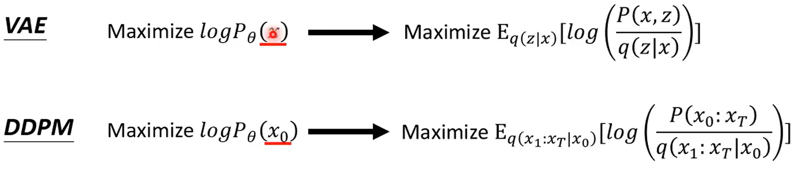

VAE 与 DDPM 虽然在建模方式上存在显著差异，但其优化目标在本质上都可视为对数据对数似然的近似最大化，且均通过引入 KL 散度的形式实现训练目标的可优化。VAE 基于变分推断，通过引入一个近似后验将对数似然下界化为重构误差与 KL 散度之和，其中 KL 项衡量了近似后验与先验 p(z) 之间的差异。而 DDPM 则构建了一个正向加噪过程和对应的反向去噪过程，最大化对数似然同样可以转化为最小化正向过程与反向过程之间的 KL 散度。通过一系列推导，DDPM 最终的优化目标可简化为一个带噪图像上噪声预测的均方误差（MSE）损失，这在形式上虽不同于 VAE，但本质上依然是对真实生成路径与模型路径之间分布差异的度量。由此可见，两者虽构建方式不同，均体现了以 KL 散度为核心的概率建模思想。

## Denoise的过程为什么还要加一个噪声

在扩散模型的去噪过程中引入噪声项，并非是对抗噪声本身的矛盾，而是一种**有意识的随机扰动机制**，用于建模生成过程中的**不确定性**。如果每一步的去噪操作完全是确定性的（即不加入任何随机性），模型最终往往会陷入均值回归的陷阱，生成出过于平滑、缺乏细节或模式崩溃的样本，难以真实反映数据分布的复杂性。

这一机制在其他生成任务中也广泛存在。例如在自回归语言模型（如 GPT）中，如果仅使用贪婪解码策略（即每一步都选取概率最大的词），生成结果往往会陷入重复、无语义连贯性的循环。而通过在概率分布上采样（如温度采样、Top-k / Top-p sampling），引入适度随机性，模型才能生成具有多样性和自然性的语言输出。

**去噪过程中引入噪声项是一种主动设计，用于恢复数据分布中的多模态特性**。它允许模型在生成过程中探索不同可能的样本空间，实现对复杂分布的有效建模，从而生成高保真且多样的样本。这也体现了生成建模中的一个核心理念：不确定性并非噪声，而是现实世界数据分布不可或缺的一部分。

## DDPM 和 Stable Diffusion的区别

在使用 Midjourney 或类似的文本到图像生成工具时，常常观察到图像从模糊逐渐变得清晰的过程。而从扩散模型（如 DDPM）的原理来看，生成过程实际上是从一张完全随机的高斯噪声图像出发，经过多个步骤的逐步去噪，逐渐还原出符合训练数据分布的样本。因此，从理论上讲，扩散过程中的中间状态是“噪声图像”，而非“模糊图像”。这主要是因为目前的主流生成框架都是使用Stable Diffusion，与传统的DDPM不同，SD对图片在latent space的表示上进行加噪和去噪的过程，我们之所以看到的不是噪声图，是因为应用端对每一步生成的latent表示进行了Decoder，展示给用户，所以用户看到的是模糊的图像而非噪声图。

# ViT


# Clip


# Blip


# Begal

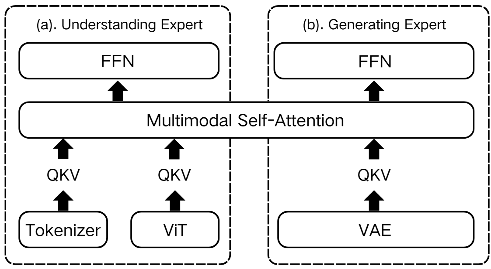

在架构层面上BAGEL 使用了 MoT 架构 来同时处理图像理解与生成任务，理解 Expert处理 ViT 编码后的视觉 token + 文本 token，用于抽取语义；生成 Expert处理 VAE 编码的潜在表示，进行图像重建或编辑。不同专家之间通过共享的 Self-Attention 模块交互，使得理解得到的高层语义能自然传导到图像生成过程中，而不通过信息瓶颈或独立推理路径，促进跨模态理解与生成之间的无损语义信息融合。 在数据层面上BAGEL 使用了大量跨模态交错数据，来自视频的时序图文对，捕捉物理世界中的概念变化来自网页文档的图文教程/百科，具备结构化、语义密集的信息流。 BAGEL的训练策略分为四个阶段，通过不同的阶段逐步提升模型的多模态理解、生成、以及高级推理能力：

- **Stage 1:**  将视觉编码器与语言模型进行对齐，确保两者在表示空间上的兼容性。此阶段中仅训练中间连接模块。 
- **Stage 2:**  执行大规模的多模态预训练，模型在包含文本、图文对、交错网页与视频等数据上学习基本的跨模态理解与生成能力。 
- **Stage 3:**  提高视觉输入的分辨率，引入更多的交错数据，从而增强模型在高分辨率图像与复杂上下文下的表现，特别是在推理与图像编辑方面的能力。
- **Stage 4:**  使用高质量任务数据集对模型进行有监督微调，进一步优化生成与理解性能，提升在多模态任务中的实用性与泛化能力。 

# Janus-pro

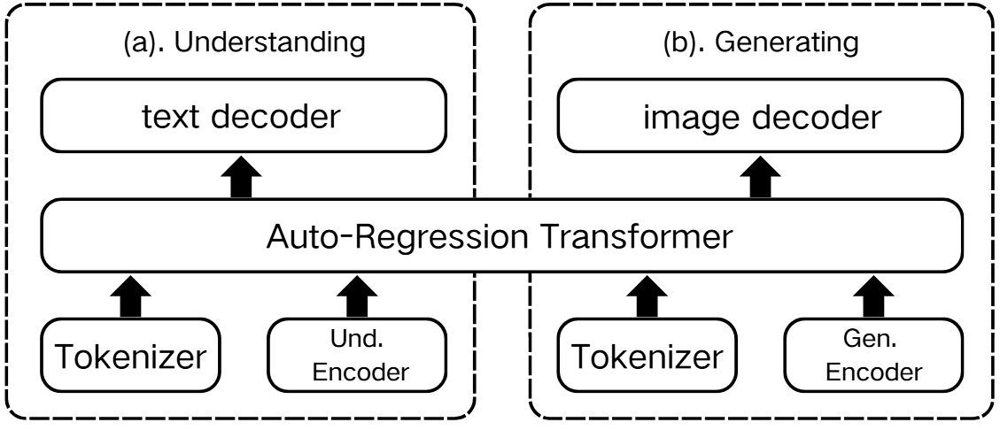

 Janus-Pro 在架构设计上简单来说就是解耦生成与理解任务，对于不同的任务采用不同的 Image encoder和输出头，更像一个多头专家系统而非 BEGAL 中的 MoT 设计。理解 Encoder 使用 SigLIP 对图像提取语义特征，通过适配器转换为语言模型输入，结合文本 token 用于视觉问答、图文理解等任务；生成 Encoder 使用 VQ 编码器将图像离散为 token 序列，并映射为语言模型输入，指导图像生成与编辑。 

- **Stage 1:** 训练理解与生成路径的适配器模块与图像头，延长训练步数以增强类别语义与图像表示之间的对齐效果。  
- **Stage 2:** 在统一的自回归框架下进行大规模图文预训练。与 Janus 不同，Janus-Pro 直接采用自然语言描述的图像对，而不再使用 ImageNet 类别数据，提升了生成任务的训练效率。 
- **Stage 3:** 在监督微调中调整数据比例（从 7:3:10 调整为 5:1:4），在保持生成能力的同时强化理解性能。 

# MetaQueries

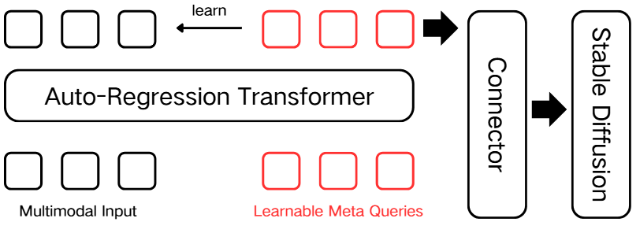

传统统一多模态模型通常通过一个大型自回归 Transformer 来同时处理文本输出和图像生成，这会导致训练上非常复杂。MetaQueries 提出理解归 LLM，生成归 Diffusion的策略，保持 MLLM 冻结，仅训练Connector模块和生成模型，简化训练流程，同时提升生成能力。为了避免直接使用 LLM 输出 token embedding 造成的生成质量差、不稳定，引入了 MetaQueries 主动引导 MLLM 激活其内部深层表示，提取理解后的知识表示而不是生成输出，拿到 MLLM 的中间条件特征 C送入Connector 编码器，将特征映射到 Stable Diffusion 输入空间，作为扩散时的 condition 生成图像。 MetaQueries的训练策略主要分为两阶段：

- **Stage 1:** 预训练阶段，在2500万对图文对上仅训练 MetaQueries、Connector 和 Diffusion 模块。 
- **Stage 2：**指令微调，构造自然图像对利用 MLLM 生成转换指令，学习图像编辑、风格转化、logo设计等复杂任务。

# UniWorld-v1

## 模型架构

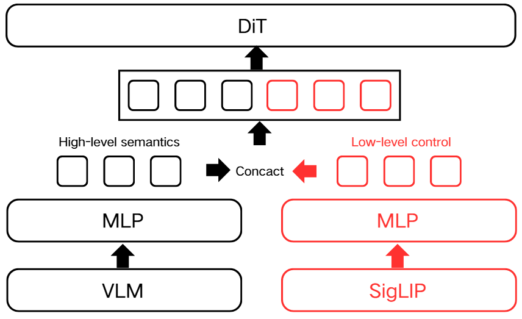

**UniWorld** 采用统一的生成架构，结合不同的子模块支持图像感知与编辑任务：

- High-level 的语义特征由预训练多模态大模型 **Qwen2.5-VL-7B** 提取，其参数在训练中被冻结，用于保持语义理解能力。
- Low-level 的像素信息通过高分辨率语义编码器 **SigLIP2-so400m/14** 提取，用于代替传统的 VAE，捕捉图像细节与全局语义。
- 生成模型 **DiT** 采用 **FLUX** 架构下的 **Flow Matching** 机制进行图像生成。
- 理解模块输出的 token 与 SigLIP 的图像特征在 MLP 层连接后输入 DiT。

> FLUX 原始使用 T5 作为语言条件，在 UniWorld 中为可选项，作者不建议在训练早期使用，以防陷入局部最优。

## 训练策略

UniWorld 训练流程分为两个阶段：

1. **Stage 1：对齐阶段**  
   - 对齐 VLM 输出与 DiT 文本分支语义表示；
   - 仅使用 VLM 的 token，不使用 SigLIP 图像特征；
   - 仅训练 VLM→DiT 的 MLP，其他参数保持冻结；
   - 此阶段模型可实现基于文字的图像生成，但缺乏参照一致性。

2. **Stage 2：一致性微调阶段**  
   - 解冻与 DiT 相连的 SigLIP 特征输入路径；
   - 引导模型利用图像特征实现参照一致的图像生成；
   - 在 5k~1w steps 后，模型开始实现复杂图像编辑任务。

## ZeRO-3 EMA

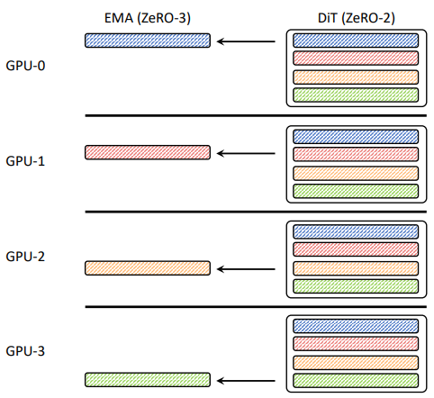

为了稳定训练，UniWorld 引入了 **ZeRO-3 EMA** 策略：

- 模型训练使用 ZeRO-2 进行并行优化；
- EMA 模型采用 ZeRO-3 跨 GPU 分片存储，每个 GPU 仅保留一部分 FP32 权重副本，有效降低内存占用；
- 每步 EMA 更新仅需原来 1/N 的计算（N 为 GPU 数），可扩展性强；
- 能平滑训练中的权重波动，支持更大 Batch Size。

## 训练数据

UniWorld 的训练数据覆盖三个主要任务：

- **图像感知任务**：约 140 万样本；
- **图像编辑任务**：约 100 万样本；
- **文本生成图像任务**：约 30 万样本，来自以下两个高质量开源项目：
  - **BLIP3-o**：最新统一多模态模型，数据包括预训练与指令调优样本；
  - **Open-Sora Plan**：开源视频生成项目，训练集包括 274 小时无水印视频和 300 万张高审美图像。

> 作者团队并未在数据量上做大规模扩张，仅用少量数据即达到多个 BenchMark 的 SOTA 水平，未来潜力可期。

## 图像编辑任务优化

大多数图像编辑任务仅涉及局部区域，统一损失函数可能掩盖关键训练信号。为此，UniWorld 提出自适应加权策略：

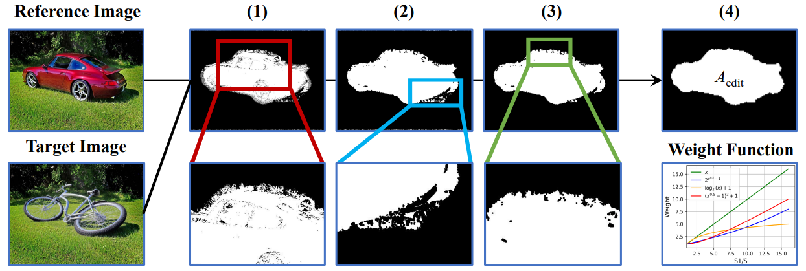

自动掩码生成流程：

1. **像素差分**：计算参考图像与目标图像的像素差异，初步标记编辑区域；
2. **膨胀操作**：扩大标记区域，缓解位移影响；
3. **连通域过滤**：去除小的噪点区域；
4. **最大池化**：增强掩码区域一致性。

定义：

- $x = \frac{A_{\text{total}}}{A_{\text{edit}}}$  
  即图像总面积与编辑区域面积之比；

希望加权函数 $w(x)$ 满足以下性质：

- 编辑区域小时（$x$ 较大），给予更高权重；
- 编辑区域为整图时，退化为统一权重（$w(1) = 1$）。

候选函数包括：

1. **Linear**:  
   $w(x) = x$

2. **Exponential Root**:  
   $w(x) = 2\sqrt{x - 1}$

3. **Logarithmic**:  
   $w(x) = \log_2(x) + 1$

4. **Quadratic Root**:  
   $w(x) = (\sqrt{x} - 1)^2 + 1$

最终采用 **对数函数**，因其增长平滑、稳定性好、适应性强。这一策略显著提升了模型对小区域编辑的聚焦与执行效果，是 UniWorld 在图像编辑任务中超越同类模型的关键之一。

## 实验结果

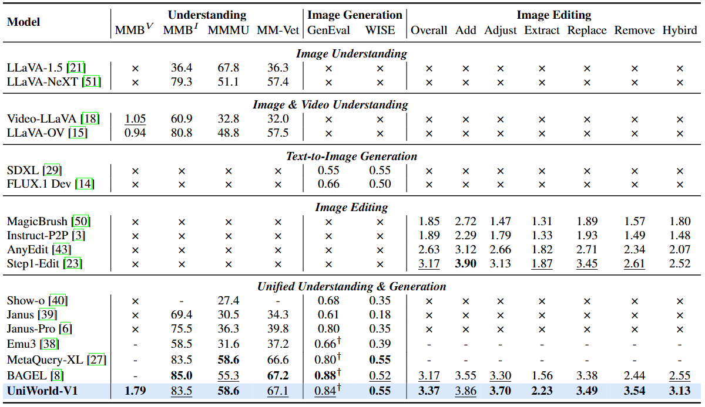

论文所提供的实验数据中 **UniWorld** 在图像理解、图像生成、图像编辑三大核心任务上均展现出领先的统一能力。  
在开源模型行列中，大部分 Benchmark 上都取得了 **SOTA 或接近 SOTA** 的表现，证明了该架构在 **多模态统一性与数据利用效率** 方面的优势。

### 文生图能力

- **GenEval 原始得分**：0.80  
- **使用 BLIP3-o 重写提示后得分**：0.84（接近 BAGEL 的 0.88）  
- **训练数据量**：仅 2.7M，远低于 BAGEL 的 2665M，显示出极强的数据利用效率。

特别地，在用于评估文生图世界知识整合能力的 **WISE** 基准上：

- **总得分**：0.55，在统一模型中表现优异；
- **空间知识类别得分**：0.73，为除 GPT-4o-Image 外最佳，表明其在空间推理方面尤为突出。

### 图像编辑能力

在 **ImgEdit-Bench** 比较中：

- **UniWorld-V1 总分**：3.37，为所有开源模型中表现最强；
- 在 Adjust、Remove、Extract、Replace、Hybrid 五个子任务中均取得开源最高分；
- 综合能力仅次于 GPT-4o-Image（4.31），是开源中最接近行业顶级的图像编辑模型。

### 图像理解能力

在以下四个图像理解 Benchmark 上表现出色：

- **MMBench**
- **MMBI**
- **MMMU**
- **MM-Vet**

得益于冻结 VLM 的策略：

- 显著减少训练资源消耗；
- 避免语义理解能力退化；
- 同时取得 SOTA 或接近 SOTA 的水平。

### 图像感知能力

目前尚无可全面评估图像感知能力的标准 Benchmark，UniWorld-V1 采用与 **GPT-4o-Image** 的案例质性对比分析：

在以下感知任务中表现出 **高度竞争力**：

- 边缘检测  
- 法线图生成  
- 语义分割  
- 草图生成  

> 多项任务中 UniWorld-V1 表现优于 GPT-4o-Image，展示其强大的感知理解和生成能力。

## 个人思考

在本项工作的开篇部分，一个精妙的对比实验设计令我印象深刻。由于无法直接获取 GPT-4o 的内部实现细节，作者巧妙地设计了一系列行为对比实验，尝试从其外在表现中反向推理其视觉特征提取机制。这一策略不仅提升了论文的可读性和说服力，也为理解封闭模型提供了新的思路。

此外，**UniWorld 在仅使用不足 0.01 倍的训练数据量的情况下，在图像编辑任务上全面超越了 BAGEL**，展现出未来与 GPT-4o-Image 竞争的巨大潜力。

我认为 UniWorld 成功的关键在于其 **VLM 与生成模型的融合方式** —— 将不同层次的语义信息直接传递给生成模型。以往的工作中，DiT 架构通常将高层语义信息作为条件向量嵌入，用以指导生成过程；而 **UniWorld 则通过 MLP 将语义信息对齐后，直接与低层像素特征拼接**，不仅保留了像素级细节，还引入了抽象语义，显著提升了生成质量。

这种拼接方式并未影响 DiT 对底层特征的建模，反而取得了卓越生成效果，这背后的机制值得深入探究。我的一些思考：

1. **生成是否反哺理解？**  
   当前大多数统一模型研究重点集中在“理解促进生成”。通过捕捉图文之间的隐式语义来提升生成质量，但**尚缺乏系统性研究探索“生成是否反哺理解”**。  例如在 UniWorld 中，VLM 模块的参数是冻结的；如果将 DiT 的梯度反向传播至 VLM，是否能提升模型的语义理解能力？  
   VLM 中包含多个编码器与解码器，**应将梯度传入哪些子模块才能最有效提升理解性能**？这些都可能成为未来探索的关键问题。
   
2. **MoE（Mixture-of-Experts）机制的融入可能性？**  
   UniWorld 中，生成模型输入已由早期 VAE + 文本嵌入，扩展为 **多层级语义输入**（包括来自 VLM 的语义特征），增强了生成指导信息。然而，多源输入特征也可能带来 **信息异质性、训练不稳定、收敛速度慢** 等问题。  
   因此未来可考虑引入 **MoE 模块** 来增强模型对多信息类型的适应能力。MoE 能根据语义特征动态激活最合适的专家网络，提升参数效率与任务泛化能力，特别适合图文生成、图像编辑、图像感知等统一模型任务。
   
3. **如何组织高效的后训练策略？**  
   UniWorld-V1 的训练流程目前主要聚焦预训练，后训练部分尚未展开深入设计。  后续版本可以引入更加系统性的后训练策略：  
   - 例如 BEGAL 引入大量图文交错样本，引导模型学习图文时序与空间位置的推理；  
   - 类似 CoT（Chain-of-Thought）风格的推理流程也可能提升多模态理解与生成能力；  
   - **构建适用于图文推理的高效后训练范式**，可作为后续研究值得重点关注的方向。

# WISE：基于世界知识的统一模型 BenchMark

## 研究背景与动机

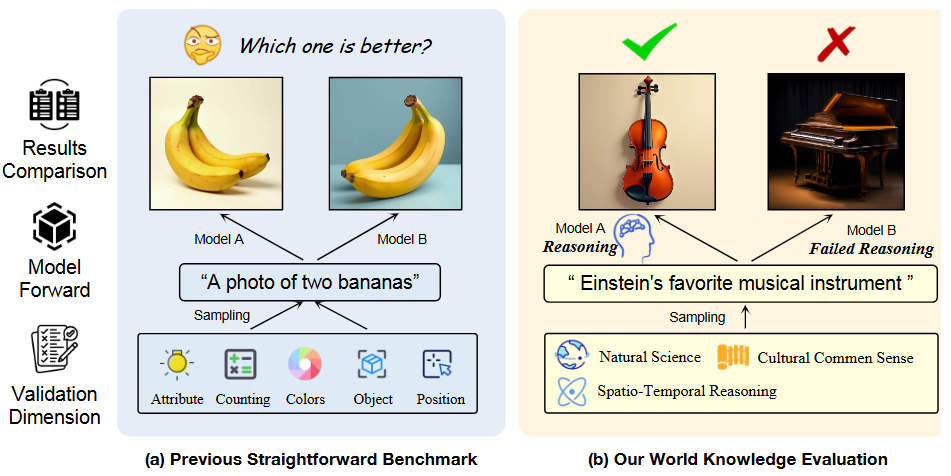
近些年来，T2I模型被应用到艺术创作，新分子发现等各个领域，生成高质量艺术创作和视觉内容的能力越来越强大。图像生成模型包括基于Diffusion的专用文生图模型例如LDM，融合自回归模型和生成模型的统一架构例如gpt4o以及最近开源的Blip3o，后者能够更好的融合世界知识，例如画一个长鼻子的动物，统一模型能结合自回归模型中的世界知识，推断出要画一只大象，这种基于世界知识的视觉推理能力对于文生图模型来说至关重要。然而先前的研究和评估标准主要聚焦于图像生成的真实感和浅层的文本语义关系，缺乏对文本到图像生成中的复杂语义理解和世界知识集成的全面评估。

## 主要贡献

为了应对以上挑战，这篇工作的贡献点包括以下三个：

1. 提出了一个专门为生成模型的世界知识语义评估设计的基准。超越简单文本到图像像素的映射，评估标准包含了文化常识等25个子领域的1000个精心的设计的Prompt提示模型；
2. 引入了WiScore，用于评估知识图像对齐的新指标，超越了简单像素级和简单文本图像对齐；
3. 最终在10个专用文生图模型和12个统一架构模型上进行了基准测试，揭示了现有的一些文生图模型在世界知识整合能力上的局限性，推进理解生成统一架构的未来发展。

## 方法与技术细节

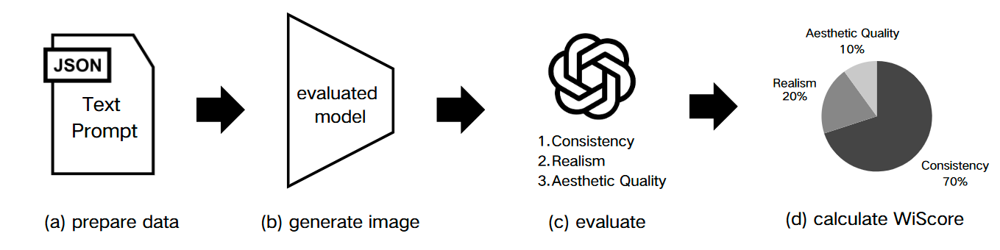

论文中介绍的基准测试流程可以分为四个步骤：

首先是数据准备部分。考虑倒现有的基准测试数据集中的Prompt设计大多采用了直接了当的形式，这些数据集主要为了评估文本到图像的简单像素还原能力，而无法评估模型的世界知识的整合能力以及把握更深层次的语义关系。因此这篇工作中从不同来源包括百科全书，教材，LLM生成语料中收集了1000条Prompt，包括文化常识，时空推理，自然科学三个大领域以及细化分出的25个子领域。文化常识要求模型掌握将视觉特征与特定文化尝试相结合的能力；时间推理评估时间和物体相对时间关系（eg. 迪拜时间晚上10点的自由女神像）；空间推理涵盖不同视图，地理关系，相对位置的评估；自然科学目标是评估模型是否能理解特定领域的专业知识，包括生物，化学，物理等等，生成与科学一致的图像。


接着我们使用待评估的模型根据准备好的Prompt生成图像，进入到下一步的评估流程。

在评估的部分，选取gpt-4o作为评价器，通过特定的Prompt模板让gpt从一致性（consistency），真实性（Realism），美学质量（Aesthetic Quality）对待评估模型生成的图片进行评估，每个方面的评分分为三个等级0（Rejected），1（Conditional），2（Exemplary），最终为每个部分的评分定义一个权重，进行加权求和。在论文中作者给一致性，真实性，美学质量的权重分别为0.7，0.2，0.1，这样不仅能保证一致性在评分过程中起主导作用，还能融入部分真实性和美感质量，保持整体画面的质感。现有的一些评估指标例如CLIP-Score，VQA-Score在面对知识密集型的提示时，缺乏对隐式视觉理解和世界知识的敏感性，而论文提出的WiScore能够很好的评估生成图像所隐含的深层次视觉信息，论文中使用同一评分过程与不同评价指标进行可靠性测试，发现WiScore与人类评分最为一致。

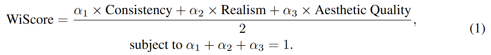

## 实验设计与结果

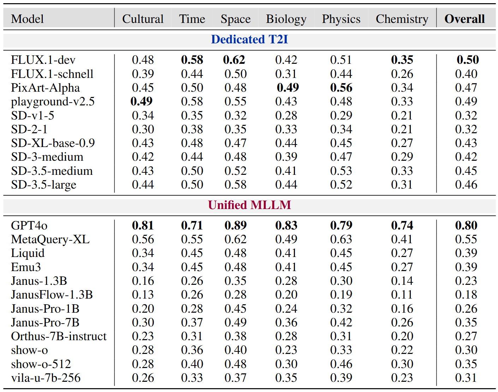

论文选取了10个专用的T2I模型以及12个同意多模态模型进行Wise基准测试，模型均使用官方默认配置。最终实验发现代表统一多模态模型的GPT-4o获得了碾压性的最佳性能，在所有类别得分和总体得分上均优于其他模型，说明GPT-4o在利用世界知识生成复杂语义图像上的卓越能力；令人诧异的是主打生成理解统一能够融入更多世界知识的统一多模态模型在Wise基准测试中并没有取得优势，统一多模态大模型大多落后于专用生成模型，这也揭示了统一多模态模型发展过程中的面临的巨大挑战，需要重新思考现有的解决方案存在的弊端。

接着论文对两种不同类型模型在不同认知维度上的差异，主要使用了统计方法来进行验证。最终发现T2I 模型在前3个维度（文化、时间、空间）的平均分显著高于后3个科学维度（生物、物理、化学），表现出视觉表征的优势；同时，随着模型代际更新（如 SD 系列、Janus 系列），这种维度间的不平衡逐渐减小，说明新一代模型正逐步改善各维度的综合能力。

论文又对Prompt重写再次进行了实验，例如将 "常见母亲节植物" 改为 "康乃馨"，让语言更加简单直白。几乎所有模型的表现都明显提升，但是整体仍未达到令人满意的只是生成水平。简化提示语显著提升了模型表现暴露出当前模型在处理复杂世界知识方面的理解与生成双重瓶颈，未来需聚焦于模型本体能力的提升而非仅依赖提示设计技巧。

## 个人思考

1. 使用LLM作为评价器是否会存在随机性？多次评价生成的WiScore指标是否会不同？
2. Wise是为了评价生成任务中结合世界知识的能力，可以验证在统一多模态大模型架构中理解任务有利于提升生成任务的表现；但是生成任务对理解任务的表现提升仍然没有被很好探索，同时也需要一个benchmark来衡量生成对理解的增益。
3. 使用gpt-4o作为评价器评价gpt-4o生成的图片是否会有运动员下场当裁判的意思？分数是否会虚高？
